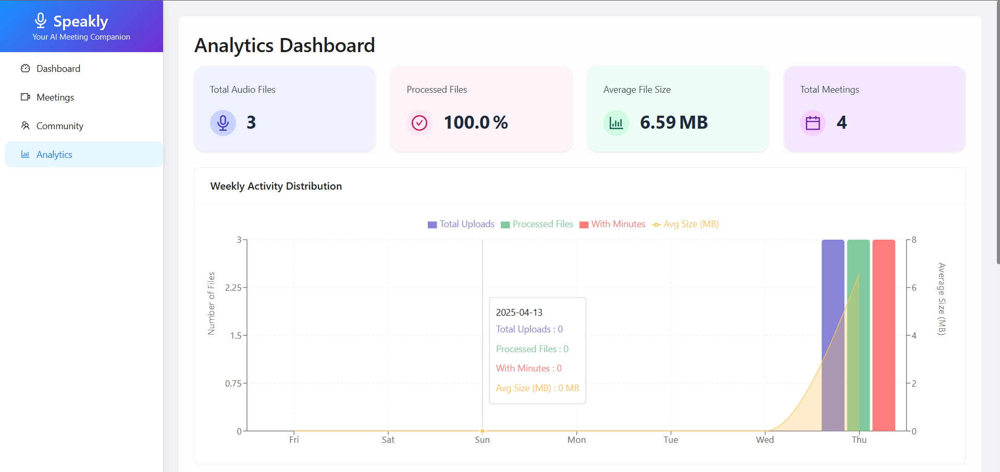
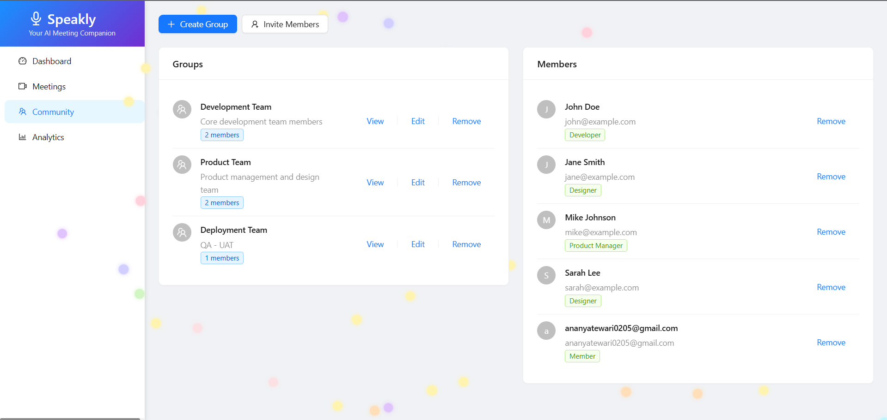
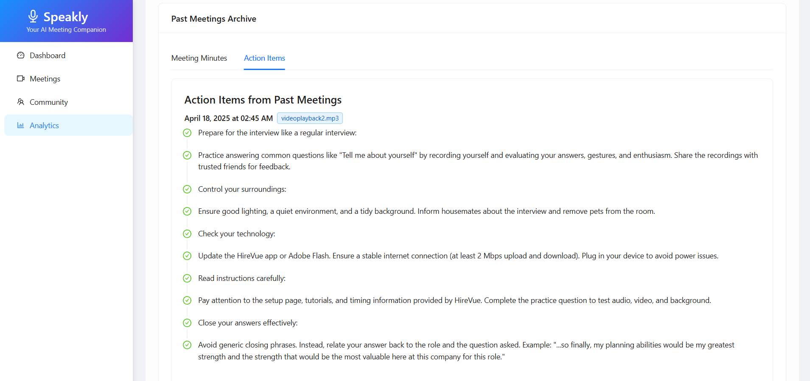
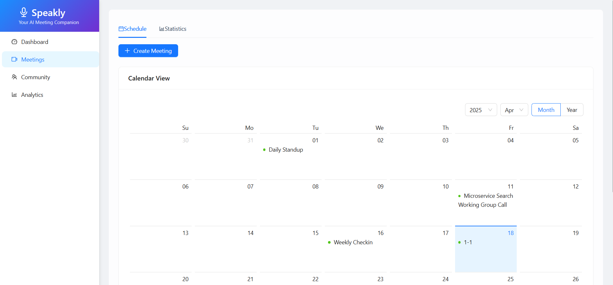
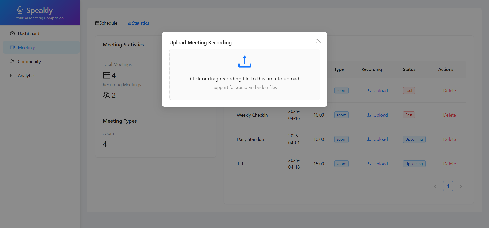

# 🚀 Speakly-BotAI — Your Autonomous AI Meeting Companion

## 🎯 The Problem

Remote meetings are packed with value—but:

- 🔍 Action items often go unnoticed  
- ✍️ Notes and summaries are inconsistent  
- ⏳ Nobody wants to replay an hour-long call  

Most tools stop at transcription.  
**Speakly** goes further—it makes your meetings *work for you.*

---

---

## 💡 What is Speakly?

**Speakly** is an AI-powered meeting assistant and collaboration platform that:

- 🎙️ **Joins live meetings** or **processes uploaded recordings**
- ✍️ Provides **accurate transcriptions** with speaker labels
- 🧠 **Summarizes**, identifies **key points**, and pulls out **action items**
- 📄 Exports everything neatly into **Google Docs**
- 🌐 Organizes your teams with a fun, animated, **canvas-based interface**

---

## 🛠️ Built During the Hackathon

### 🎧 Audio & Transcription
- Built with **OpenAI Whisper**
- Speaker-aware, timestamped, highly accurate

  
  

### 🤖 Smart Summarization
- Powered by **GPT-4 + LangChain**
- Outputs include:
  - 📝 Summary
  - 📌 Key Points
  - ✅ Action Items
  - 👥 Participants
  - 🧾 Minutes of Meeting

### 🖥️ React Frontend
- ⚛️ Built using **React + TypeScript**
- Upload and transcribe recordings
- View summaries, transcripts, and insights
- 💬 Manage members, teams, and docs visually
- 📤 Export one-click meeting recaps to **Google Docs**
- 📆 **Calendar integration** to automate follow-ups
- 🧠 Searchable knowledge base of past meetings
- 🎨 Team canvas with **animated, hoverable visuals**

---

## ✅ What We Achieved

- ✅ Transcription pipeline with OpenAI Whisper  
- ✅ AI summarization and action item generation  
- ✅ Interactive React UI with team visualizer  
- ✅ Google Docs integration for outputs  
- ✅ Group and team management in a beautiful interface  

---

## 💫 Why Speakly?

Because meetings should do more than just happen.  
They should generate insight, action, and structure—**automatically**.

Speakly turns conversations into documentation, tasks, and strategy with **zero manual effort**.

---

## 👥 Built by Team Vector

A caffeine-powered creation by a passionate team focused on:
- 🔥 Productivity tools
- 🤖 Practical AI
- 🎨 Beautiful, joyful UI
- 💡 Collaborative experiences

*NOTE:* For security reasons, we have excluded .env and other sensitive configuration files from this repository.
If you're an evaluator and would like to run the project locally, please reach out to us at ananyatewari0205@gmail.com—we'll be happy to assist!

---

> "Meetings shouldn't be memory games. Let Speakly handle the memory—so your team can focus on momentum."  
> — Team Vector
